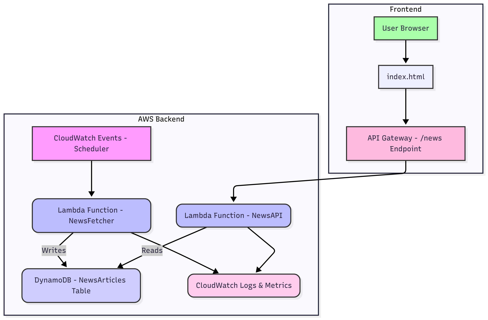

# **Serverless News Aggregator**

This is a serverless web application designed to periodically fetch news from various RSS feeds, store the articles in a NoSQL database, and expose them through a RESTful API. The project also includes a simple static website to display the news, hosted on Amazon S3.

This project is a great example of a serverless architecture using key AWS services.

## **Project Architecture**

The application is built on a serverless stack, leveraging several core AWS services to manage data ingestion, API exposure, and front-end hosting.

1. **News Ingestion**: An AWS Lambda function (NewsFetcherFunction) is triggered on a schedule by Amazon EventBridge (formerly CloudWatch Events). This function fetches articles from configured RSS feeds.  
2. **Data Storage**: The NewsFetcherFunction saves the aggregated news articles into a DynamoDB table named NewsArticles.  
3. **API Backend**: A second AWS Lambda function (NewsAPIFunction) serves as the backend for the news API. It queries the NewsArticles table and returns a JSON response.  
4. **API Gateway**: Amazon API Gateway provides a public REST endpoint that invokes the NewsAPIFunction, making the news data accessible over HTTP.  
5. **Front-End**: A static website, hosted on an Amazon S3 bucket, fetches and displays the news by calling the API Gateway endpoint.

## **AWS Services Used**

* **AWS Lambda**: For running serverless code.  
* **Amazon DynamoDB**: A NoSQL database for article storage.  
* **Amazon API Gateway**: To create and manage the RESTful API.  
* **Amazon S3**: For static website hosting.  
* **Amazon EventBridge**: To schedule the news ingestion process.  
* **Amazon CloudWatch**: For monitoring and logging.  
* **AWS IAM**: To manage permissions and security.

## **Setup and Deployment**

This project requires an AWS account. The steps to deploy this application are detailed in the project's documentation, but they generally involve:

1. Creating a DynamoDB table.

2. Deploying the NewsFetcherFunction to ingest data.  
[NewsFetcherFunction](./proofs/NewsFetcherLambda.yaml)

3. Setting up an EventBridge rule to schedule the NewsFetcherFunction.  
[EventBridge](./proofs/Rule-FetchNewsSchedule-CloudFormation-Template.yaml)

4. Deploying the NewsAPIFunction to handle API requests.  
[NewsAPIFunction](./proofs/NewsAPIFunction.yaml)

5. Creating an API Gateway endpoint for the NewsAPIFunction with CORS enabled.  
[APIendpoints](./proofs/api_gateway.png)

6. Configuring and uploading the static website to an S3 bucket with public access enabled.
   
[Watch Demo](./proofs/s3staticwebsite.mp4)

[Dataset](./proofs/results.csv)

## **Code Structure**

* news\_fetcher.py: The Python script for the Lambda function that fetches and stores news.  
* news\_api.py: The Python script for the Lambda function that retrieves and serves news via the API.  
* index.html: The front-end HTML, CSS, and JavaScript for the static website.

## **Monitoring**

All Lambda function logs are automatically sent to **Amazon CloudWatch**, which is crucial for monitoring, debugging, and setting up alarms for errors.

## **Cleanup**

To avoid unexpected AWS charges, be sure to delete all resources once you are finished with the project. The recommended order for deletion is: S3 bucket, API Gateway, Lambda functions, DynamoDB table, IAM roles, and finally, the EventBridge rule.
